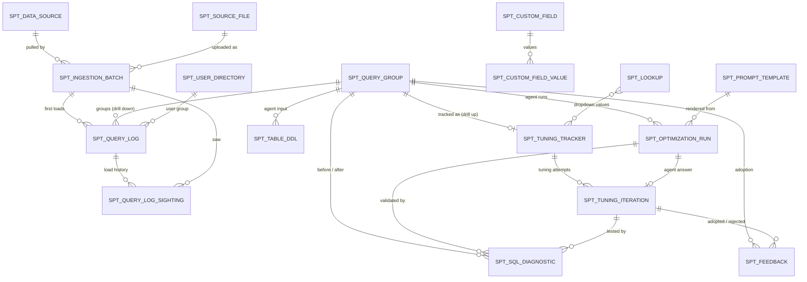
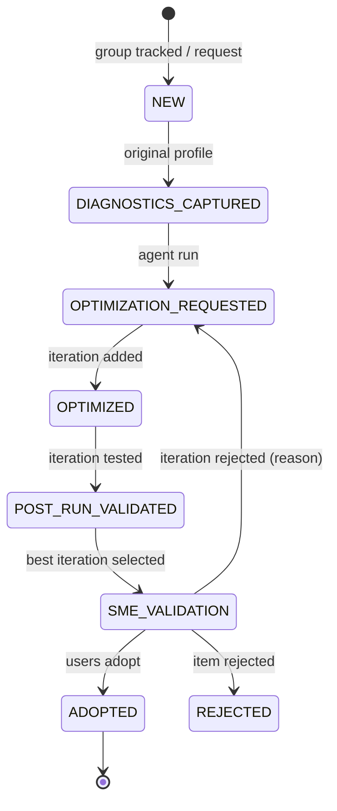

# Architecture

## Workflow mapping

The numbers match the *Impala SQL – Performance & Tuning – Tactical Workflow* diagram.

| Step | Diagram box | Where it lives |
|---|---|---|
| 1 | SQL execution (business users) | Source systems; the app ingests their query logs |
| 2 | Identify long running SQL | `IngestionService` (CSV / Excel upload or JDBC pull) + `GroupingService` |
| 3 | SQL DB | `SPT_*` tables (Oracle in shared environments, SQLite locally) |
| 4 | Retrieve bad SQL diagnostics | Group → **Diagnostics** tab, `POST /api/groups/{id}/diagnostics` (phase `ORIGINAL`) |
| 5 | SQL Diagnostic Tool (run, explain, profile, exec summary) | Stored in `SPT_SQL_DIAGNOSTIC` |
| 6 | Parse profile | `ImpalaProfileParser` → `PROFILE_SUMMARY` JSON, execution / teardown seconds |
| 7 | Optimization prompts | `SPT_PROMPT_TEMPLATE` (versioned), Administration → Prompt templates |
| 8 | Optimization agent (Get DDL, bad SQL, DDL, explain, exec summary) | `SPT_TABLE_DDL`, `PromptRenderer`, `OptimizationAgent` port |
| 9 | Agent output (change narrative, optimized SQL) | `SPT_OPTIMIZATION_RUN` → a new `SPT_TUNING_ITERATION` (manual iterations too) |
| 10 | Run new SQL (post-run diagnostics) | Diagnostics with phase `OPTIMIZED` for an iteration → its test results; the best iteration is selected and copied to the tracker |
| 11 | Load output | Before/after rows in `SPT_SQL_DIAGNOSTIC` + tracker metrics |
| 12 | Olympus Tuning Diagnostic Tool (inventory, adoption) | Tuning Tracker, Pipeline board, Insights + `SPT_FEEDBACK` (adopt / reject an iteration) |
| Note | Failed optimization feedback | `SPT_FEEDBACK` with `REJECTED` + `REJECTION_REASON`; the iteration is rejected and the item goes back to Tuning |

### LLM integration

`OptimizationAgent` is a port. The default `ManualOptimizationAgent` returns no answer: the run stays
`PENDING` with the fully rendered prompt, an analyst runs it in the approved LLM tool and pastes the
answer back (`POST .../optimization-runs/{runId}/response`). To call an LLM gateway directly, add a Spring
bean implementing `OptimizationAgent`; it is picked automatically over the manual one. The answer must
contain a ```` ```sql ```` block (the default prompt asks for `### CHANGE NARRATIVE` / `### OPTIMIZED SQL`).

## Data model



`SPT_LOOKUP` (dropdown values per category) and `SPT_USER_DIRECTORY` (user id → user group) are matched by
value, not by foreign key, so values can be renamed or retired without touching history.

Drill path: **Tracker (T-n) → Group (#n) → Log rows**, and back up from any log row via `GROUP_ID`
and from a group via its tracker. Group metrics are *not* copied to the tracker; the tracker screen and
the `SPT_TRACKER_V` reporting view join them live, so a re-import updates both screens.

### Screen columns → tables

**Query log screen** (`SPT_QUERY_LOG`): seq_id, executed_query, user_query, error_code, error_category,
error_message, user_id (header alias `useris` accepted), start_time, end_time, duration_minutes. Extra:
`BATCH_ID` (the import that processed it), `FINGERPRINT`, `GROUP_ID`, `SQL_ENGINE`, `ROW_KEY`,
`SEEN_COUNT` (loads containing the row), `LAST_SEEN_AT` / `LAST_SEEN_BATCH_ID`.

**Grouping screen** (`SPT_QUERY_GROUP`): group_id (`ID`), group_size, user_id(s) (`USER_IDS`, plus
`DISTINCT_USERS`), duration_count, avg/min/max/total_duration_minutes, sample_query, row_indices
(member seq_ids), fingerprint. Extra: `NORMALIZED_QUERY` (the hashed text), `ERROR_COUNT`,
`FIRST_SEEN`/`LAST_SEEN`, `SAMPLE_LOG_ID`. The sample is the **longest running** member (the "bad SQL").

**Tracking screen** (`SPT_TUNING_TRACKER` + live group columns): every column in the specification.
Naming decisions:

| Spec column | Column | Note |
|---|---|---|
| sample_query_raw | `SPT_QUERY_GROUP.SAMPLE_QUERY` | live from group |
| sample_query_formatted | `SAMPLE_QUERY_FORMATTED` | pretty printed on creation, editable |
| cleansed_query | `CLEANSED_QUERY` | comments / whitespace removed, still runnable |
| optimzed_query | `OPTIMIZED_QUERY` | filled from the accepted agent run |
| Optimized SQL | `OPTIMIZED_SQL_STATUS` | treated as a status (e.g. Yes / No / In progress) because the SQL itself is `OPTIMIZED_QUERY` |
| OG / Post Run Execution Time | `*_EXECUTION_TIME_SECONDS` | seconds |
| OG / Post Run tear down time | `*_TEARDOWN_TIME_SECONDS` | seconds; from profile timeline (last row fetched → unregister) |
| OG / post run tear down percentage | `*_TEARDOWN_PCT` | derived as teardown ÷ run duration when left empty |
| install / execute / Validation | `INSTALL_STATUS` / `EXECUTE_STATUS` / `VALIDATION_STATUS` | avoids reserved-looking names |

Added for enterprise use: `WORKFLOW_STATUS` (the stage), `PRIORITY`, audit columns, `VERSION` (optimistic
locking: two people editing the same row get a 409 instead of silently overwriting each other).

Added for tuning analytics (V4): `REQUEST_SOURCE` (log detected / proactive UAT / user request),
`REQUESTED_BY`, `ENVIRONMENT`, `STAGE_CHANGED_AT`, `ADOPTED_AT`, `CLOSED_AT`, `SELECTED_ITERATION_ID`, and
OG / post-run `CPU_SECONDS`, `ROWS_SCANNED`, `TABLES_SCANNED`, `BYTES_SCANNED`, `PEAK_MEMORY_MB`.

## Tuning lifecycle



Labels in the UI: Triage, Diagnosed, Tuning, Candidate ready, Tested, Awaiting adoption, Adopted (plus
Rejected, On hold). Every change is an `SPT_AUDIT_EVENT`, from which the journey and turnaround (Q9) are
derived. Details: [developer-guide.md §8](developer-guide.md#8-tuning-lifecycle-stages-and-iterations).

## Insights

`InsightsService` computes the 15 programme questions on the fly from logs, groups, tracker, iterations,
feedback and audit events (no reporting tables). Definitions and endpoints:
[developer-guide.md §9](developer-guide.md#9-insights-insights).

## Loads and de-duplication

Logs may be loaded several times a day (files or JDBC). **Each log row is processed once**:

- `SPT_QUERY_LOG.ROW_KEY` (unique) identifies a row: SHA-256 of engine, seq_id, user, start/end time and
  SQL text (`spt.ingestion.row-identity=CONTENT`, or `SEQ_ID` for sources with stable unique ids).
- A known row is not inserted, fingerprinted or regrouped again. The load adds a row to
  `SPT_QUERY_LOG_SIGHTING` (history) and increments `SEEN_COUNT` / `LAST_SEEN_*` on the log row.
- `SPT_SOURCE_FILE` stores the SHA-256 of every successfully processed upload with `LOAD_COUNT`. An
  identical upload is **not parsed**: its batch gets `DUPLICATE_OF_BATCH_ID`, `FILE_LOAD_NUMBER` and
  `ROWS_DUPLICATE`, and the processing batch's sightings are copied to it.
- `SPT_INGESTION_BATCH` reports `ROWS_READ`, `ROWS_LOADED` (new), `ROWS_DUPLICATE`, `ROWS_REJECTED`.

Details and the flow diagram: [developer-guide.md §5](developer-guide.md#5-ingestion-and-process-each-row-once).

## Fingerprinting (grouping key)

`SqlFingerprinter` normalizes the SQL and hashes it with SHA-256:

1. strip `--` and `/* */` comments, collapse whitespace, lower-case keywords and identifiers;
2. remove **every WHERE clause** at any nesting depth (CTEs and sub-queries included) up to the next
   `GROUP BY` / `ORDER BY` / `HAVING` / `LIMIT` / `UNION` / closing parenthesis;
3. replace remaining literals with `?` and collapse `IN (?, ?, ?)` to `IN (?)`;
4. drop trailing semicolons.

So `... WHERE region = 'EMEA'` and `... WHERE region = 'APAC' AND dt > '2026-01-01'` share a group, while
a different select list, join or grouping does not. Behaviour is configurable (`spt.fingerprint.*`); after
changing it, run **Rebuild** on the groups screen (`POST /api/groups/rebuild`). `EXECUTED_QUERY` is hashed,
falling back to `USER_QUERY` (or the reverse with `prefer-user-query: true`).

## Adding columns

Two mechanisms, use whichever fits:

1. **Runtime custom columns** (no deployment): Administration → Custom columns. Fields are typed
   (text, long text, number, date, boolean, enum), optionally required, appear on the tracker screen, the
   edit form and the Excel export, and every change is audited. Stored in `SPT_CUSTOM_FIELD(_VALUE)`.
2. **Real columns** (when a field becomes core / needs indexing): add `V<n>__*.sql` to **both**
   `db/migration/oracle` and `db/migration/sqlite`, the field to the entity, `TrackerDto` and
   `TrackerUpdateRequest` (same property name: the update copies by name and audits automatically), and a
   line in `frontend/src/app/features/tracker/tracker-columns.ts` plus the edit form.

## Data sources

Configured under Administration → Data sources (`SPT_DATA_SOURCE`). The `LOG_QUERY` must alias its columns
to the standard log names; `:since` is bound to the newest `START_TIME` already loaded, so repeated pulls
are incremental. Passwords are never stored: `PASSWORD_REF` names an environment variable / property.

- **Oracle**: `ojdbc11` ships with the service.
- **Impala**: the Cloudera Impala JDBC driver is not on Maven Central. Publish it to your internal
  repository and add it as a `runtime` dependency in `backend/pom.xml` (simplest), or build the jar with the
  Boot `ZIP` layout and pass `-Dloader.path=/opt/drivers`. Set `driverClass` to `com.cloudera.impala.jdbc.Driver`.

## Security

`spt.security.mode=NONE` for local development. In shared environments use the `prod` profile: the API
becomes an OAuth2 resource server validating JWTs from `SPT_JWT_ISSUER_URI`, and the authenticated user is
written to all `*_BY` audit columns.
